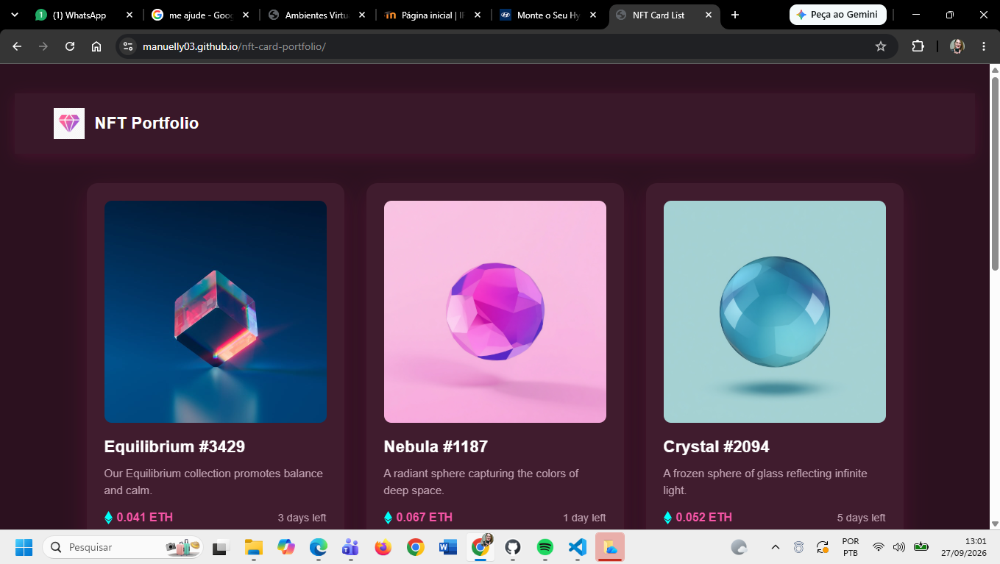
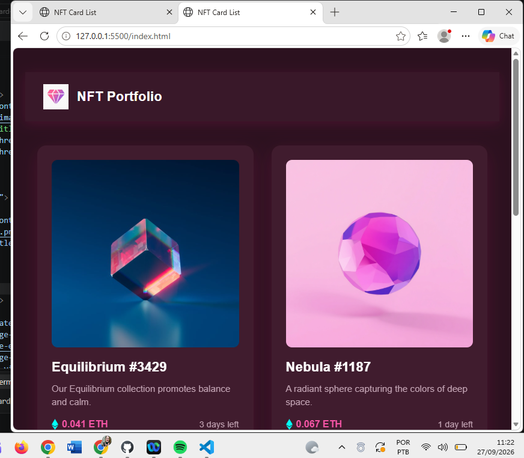

 feature/readme
# NFT Portfolio

Projeto desenvolvido como desafio de portfólio (Fases 1.0, 1.1 e 1.2), com foco em HTML, CSS e JavaScript, seguindo boas práticas de Git/GitHub.

##  Acesse o projeto

https://manuelly03.github.io/nft-card-portfolio/

##  Sobre o projeto

O projeto consiste em um portfólio de cards NFT, desenvolvido em três fases:

- *Fase 1.0:* criação de um card NFT individual, seguindo o design do desafio do Frontend Mentor, com efeito de hover.
- *Fase 1.1:* expansão para uma lista com vários cards (CardList), com imagens geradas por IA e animações de entrada.
- *Fase 1.2:* criação de um Header com logo personalizada, também gerada por IA.

Além disso, foi adicionado um botão de curtir interativo em cada card, utilizando JavaScript.

##  Tecnologias utilizadas

- HTML5
- CSS3
- JavaScript
- [Animate.css](https://animate.style/) — animações de entrada dos cards
- [Leonardo.ai](https://app.leonardo.ai/) — geração das imagens dos NFTs e da logo
- Git e GitHub — versionamento e controle de branches
- GitHub Pages — hospedagem do projeto

##  Fotos da aplicação

##  Funcionalidades

- Cards responsivos (mobile e desktop)
- Efeito de hover nos cards
- Animações de entrada (Animate.css)
- Header com logo personalizada
- Botão de curtir interativo (JavaScript)

##  Autoras do projeto

- Manuelly Fernandes
- Dheroly Gomes

# NFT Portfolio

Projeto desenvolvido como desafio de portfólio (Fases 1.0, 1.1 e 1.2), com foco em HTML, CSS e JavaScript, seguindo boas práticas de Git/GitHub.

##  Acesse o projeto

https://manuelly03.github.io/nft-card-portfolio/

##  Sobre o projeto

O projeto consiste em um portfólio de cards NFT, desenvolvido em três fases:

- *Fase 1.0:* criação de um card NFT individual, seguindo o design do desafio do Frontend Mentor, com efeito de hover.
- *Fase 1.1:* expansão para uma lista com vários cards (CardList), com imagens geradas por IA e animações de entrada.
- *Fase 1.2:* criação de um Header com logo personalizada, também gerada por IA.

Além disso, foi adicionado um botão de curtir interativo em cada card, utilizando JavaScript.

##  Tecnologias utilizadas

- HTML5
- CSS3
- JavaScript
- [Animate.css](https://animate.style/) — animações de entrada dos cards
- [Leonardo.ai](https://app.leonardo.ai/) — geração das imagens dos NFTs e da logo
- Git e GitHub — versionamento e controle de branches
- GitHub Pages — hospedagem do projeto

##  Fotos da aplicação

##  Funcionalidades

- Cards responsivos (mobile e desktop)
- Efeito de hover nos cards
- Animações de entrada (Animate.css)
- Header com logo personalizada
- Botão de curtir interativo (JavaScript)

##  Autoras do projeto

- Manuelly Fernandes
- Dheroly Gomes
main
